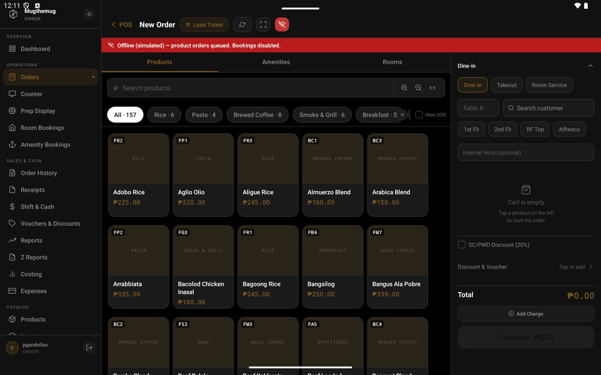
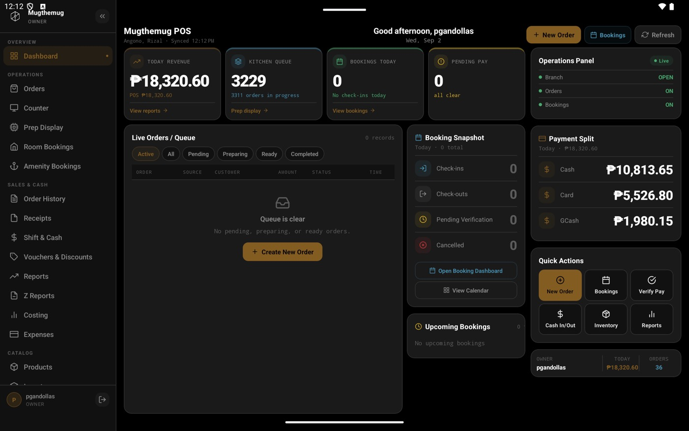
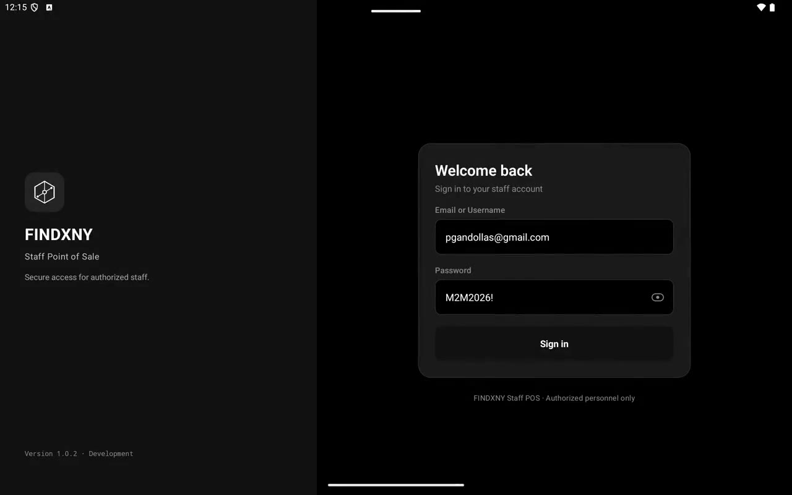

# FINDXNY OS

**A multi-tenant POS + booking platform that keeps ringing up sales even when the internet doesn't show up.**

Built solo — web storefront, admin back office, an Expo POS/kitchen app, and the Supabase/Postgres backend behind all of it. This is a public, redacted snapshot of the real codebase (see [Notes on this snapshot](#notes-on-this-snapshot) below).

<p align="center">
  
  
</p>

## What it actually does

It runs a real business: [**mugthemug.ph**](https://mugthemug.ph) — a 24/7 café, restaurant, and staycation lounge — end to end. Customers order and book on the web, cashiers ring it up on a tablet POS, the kitchen sees tickets appear on a prep board, and payments settle through Xendit. If the wifi drops mid-shift, the cashier doesn't notice.

|  |  |
|---|---|
| 🧩 **114** Deno Edge Functions | across auth, catalog, orders, bookings, payments, staff, and reports |
| 🗄️ **56** Postgres tables, **121** foreign keys | tenant-isolated with Row-Level Security, not app-layer filtering |
| 📜 **119** migrations | the honest, incremental history of getting this right |
| 📴 Offline-first POS | SQLite queue + idempotency keys, survives app restarts |
| 🧾 Real hardware | ESC/POS + IMIN thermal printing, physical cash drawer, secondary display |

## Watch it work

<p align="center">
  <a href="docs/screenshots/pos-walkthrough.mp4">
    
  </a>
  <br/><sub>Order entry → simulated offline mode → checkout → kitchen prep board (click to play, ~3.5 min)</sub>
</p>

## The storefront it powers

<p align="center">
  
  
  
  
</p>

## Architecture

```
 Customer Web        Admin Web         POS + Kitchen (Expo)
 (Next.js)           (Next.js)         │
      │                   │            ├── SQLite offline queue
      └─────────┬─────────┘            │   (orders/payments/shift actions)
                │                      │
                └──────────┬───────────┘
                           ▼
          114 Deno Edge Functions (business rules live here —
          clients never compute prices, totals, or permissions)
                           │
              ┌────────────┴────────────┐
              ▼                         ▼
     Supabase Auth              PostgreSQL (56 tables, RLS)
                                         │
                           ┌─────────────┴─────────────┐
                           ▼                            ▼
                Xendit (Invoice + webhooks)     ESC/POS · IMIN · cash drawer
```

Full write-up (with an actual case study, not just this README) is on my portfolio: **[the FINDXNY OS case study →](https://mugthemug.ph)**

## Tech stack

| Layer | Stack |
|---|---|
| Web | Next.js 14, React 18, Tailwind CSS 4 |
| POS client | Expo (React Native 0.83), `expo-router`, `expo-sqlite` |
| Backend | Deno Edge Functions on Supabase |
| Data & auth | PostgreSQL, Row-Level Security, Supabase Auth |
| Payments | Xendit Invoice API + webhooks |
| Testing & delivery | Vitest, Playwright, EAS Build/Update |
| POS hardware | ESC/POS (USB/Bluetooth), IMIN thermal SDK, native cash drawer |

## A few things I'm proud of, engineering-wise

- **Idempotency everywhere it matters.** Mutating endpoints accept an `Idempotency-Key` header; the server hashes the request body and rejects a replay with a *different* body outright, rather than silently applying it twice.
- **Payment webhooks that can't double-fire.** `payments-webhook` inserts into a `webhook_events` table *before* touching any state — a unique constraint on `(invoice, status)` means a duplicate Xendit delivery loses the race and no-ops, instead of double-crediting an order.
- **Offline that degrades gracefully, not silently.** An order that fails to sync 8 times surfaces to the cashier as "stuck" instead of retrying into the void forever.
- **Hardware quirks handled where they actually live.** The ESC/POS module tried raw byte injection for IMIN printers first — it "succeeded" without ever reaching the print head. The fix uses IMIN's structured SDK calls instead, with the discovery documented right next to the code, not lost in a Slack thread.

## Notes on this snapshot

This is a single squashed commit, not the real project history — the actual repo has 240+ commits and several environments. A couple of internal ops files and two hardcoded secrets that were sitting in old migration files (a cron auth header and a Supabase anon key embedded in a `pg_cron` call) were redacted/replaced with placeholders before this was made public. Business-sensitive seed data, deployment runbooks, and one-off internal scripts were left out entirely — everything else here is the real, working codebase.

---

Solo build by [Prince John Gandollas](https://github.com/pjDevph) · [Live storefront ↗](https://mugthemug.ph)
